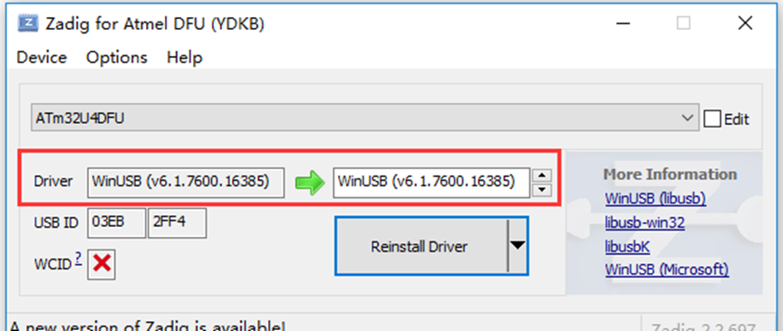
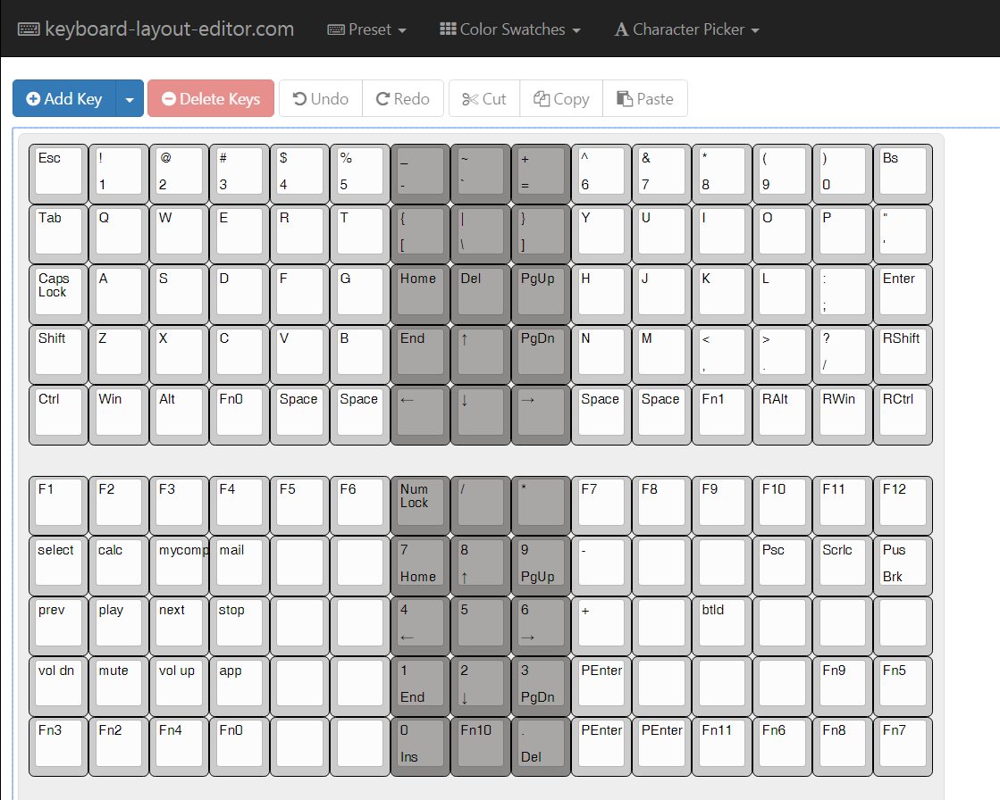
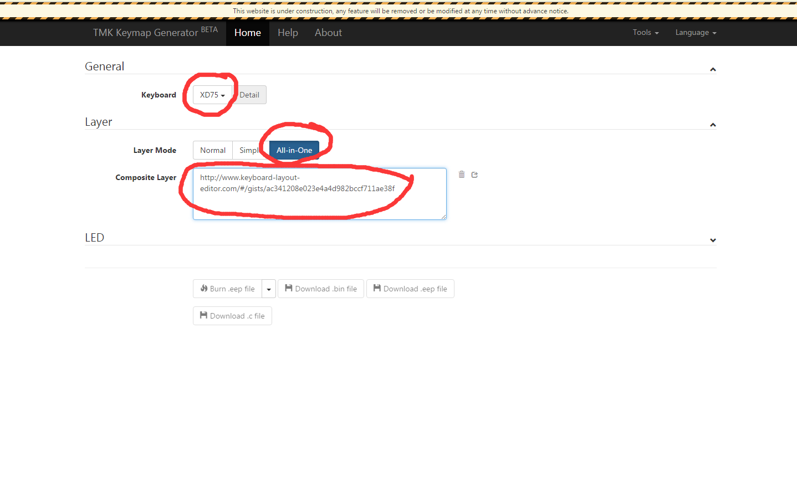
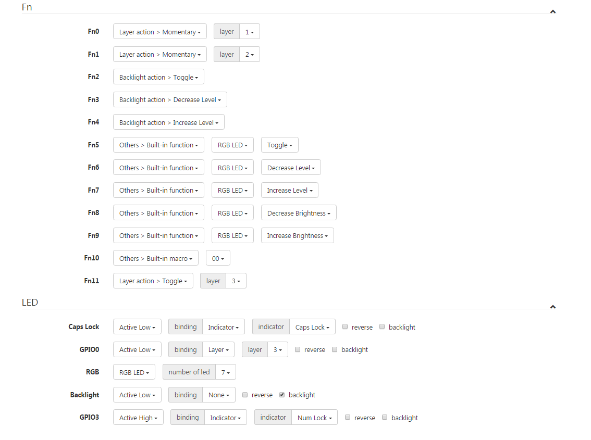
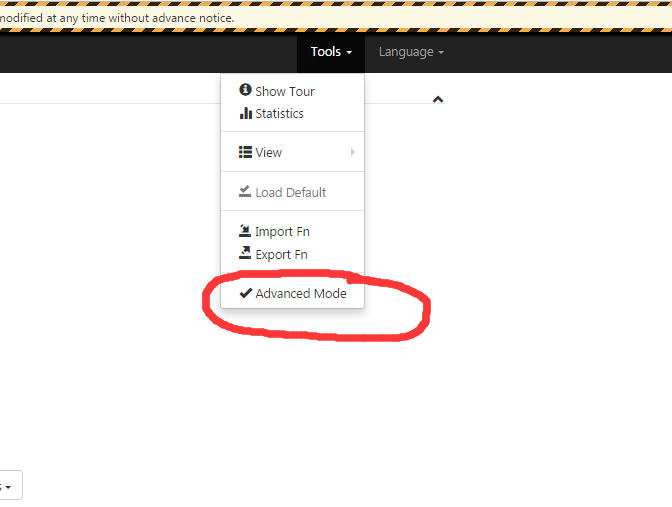
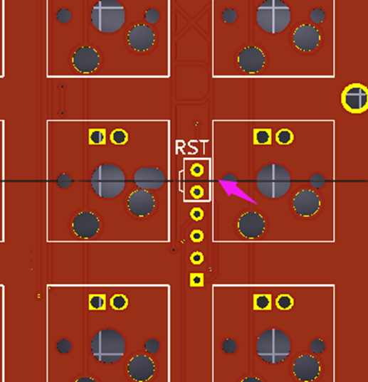

**How to Flash XD75**

1、First connect your pcb to pc

2、use your tweezers touch two hole at the white box at the same time so that your PCB come into Bootloader mode

**3、Make sure you have install usb driver first.How to do?** Open **Zadig for Atmel DFU** , if the left Version is same with right in the red box , you don&#39;t need install usb driver, if not, please click &quot;install driver&quot; to install USB driver.

**4、** Open chrome in our document(we have install plugin well)

**Click this KLE link and you will see xd75 layout**

[http://www.keyboard-layout-editor.com/#/gists/ac341208e023e4a4d982bccf711ae38f](http://www.keyboard-layout-editor.com/#/gists/ac341208e023e4a4d982bccf711ae38f)

Attention: if you want to edit this layout, just need select a key and then use your arrow key to move location/press right shift and arrow key to increase or decrease length/press Add Key is to add one blank keycap.

5、Input kai.tkg.io in our chrome browser： [http://kai.tkg.io/](http://yang.tkg.io/)

6、Do like the image below(you can copy and paste KLE layout url into composite layer,pls choose **XD75** in Config, the Fn and LED setting should be selected like the pic below)：

**If your LED options have no GPIO0/RGB/Backlight, please do like the following pic:**

7、Then use your tweezers touch two hole at the white box at the same time so that your PCB come into Bootloader mode and the button&quot;burn.eep&quot; will becomes green color

8、then click burn.eep file

Waiting for about 5 sec and everything will be completed!
