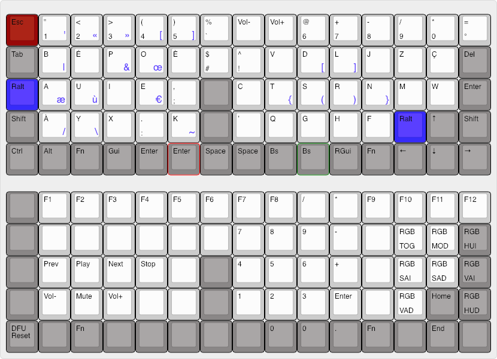

# Compilation avec Docker

Adaptation du layout Bépo pour le XD75RE

```sh
$ git clone https://github.com/qmk/qmk_firmware.git
$ cd qmk_firmware/
$ docker run -e keymap=c4software_bepo -e keyboard=xd75 --rm -v $('pwd'):/qmk:rw edasque/qmk_firmware
```


